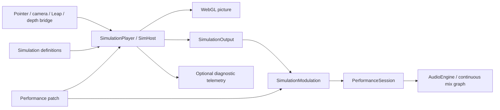

# Simulation studio and mixer

The repository has two entry points and one simulation runtime:

- `sim.html`: develop and tune simulations without loading music.
- `index.html`: perform with a simulation and the stem mixer together. Simulation is the default Play mode; Hand space and Manual controls remain available.

There is no copy or port of a simulation when it moves into the mixer. Both pages mount `SimulationPlayer`, use the same registry, shaders, physics, source adapters, and calibration. A **performance patch** records the choices that turn a simulation into an instrument.

## Dependency boundaries



`src/sim/` owns simulation behavior and input. Its core contracts have no dependency on mixer internals. `src/audio/` and `src/music/` own sound, transport, scheduling, automation, and playback gates. They do not know which simulation is active. `src/integration/` is the composition layer: it validates patches, maps declared signals to musical controls, and supplies the editor shared by both entry points.

Keep these as modules in the existing Vite application. Separate packages, an iframe, a second server, or a network hop are unnecessary for in-process control. The Python bridge remains a separate process because it owns hardware access. Existing telemetry remains useful for monitoring and external consumers.

## Runtime and clock ownership

`SimulationPlayer` owns mounting and visibility lifecycle. `SimHost` owns one renderer and input source, its fixed physics step, and a read-only `latestOutput`. Only a successfully rendered frame publishes output. Stop, recreation, and rendering/context failures clear it.

`SimulationOutput` contains the simulation ID, a monotonic browser timestamp, named signal values, and conditioned presence/activity. It is updated every rendered frame independently of telemetry subscriptions, endpoints, and rate. The mixer reads it on its existing scheduler tick. The embedded player disables external telemetry transports so a studio tab cannot send it a stray selection/parameter command.

The mapper normalizes each route's input interval, clamps it, applies output endpoints (which may be reversed), and smooths by elapsed time. A constant source supports a fixed control. Missing/nonfinite, wrong-simulation, reordered, future, or more-than-500-ms-old output releases engagement. The audio graph owns the actual release ramp and lets existing effect tails finish.

The simulation may continue changing sound after the hand leaves: water energy, cloth motion, ink, and light have their own lifetimes. Absence of a hand is not a renderer failure. Use the optional Hand presence source when a patch should explicitly gate on the performer instead.

Rendering pauses during music loading/analysis and when the page is hidden. Changing Play modes stops the simulation source; entering Simulation stops the legacy camera/Leap controls. Switching between Play, Build mix, and Setup keeps the simulation alive while preserving its canvas dimensions. Raw-control replay suspends the live simulation so recorded controls have sole ownership.

## Musical controls

The first mapping surface uses the mixer's existing continuous graph:

| Patch target | Musical effect | Existing graph field |
|---|---|---|
| `engagement` | Introduces vocals and effect sends; zero returns to the instrumental bed | `SpaceState.presence` |
| `balance` | Moves from rhythm toward melody/harmony | `SpaceState.height` |
| `space` | Adds dotted-eighth echo and diffuse reverb | `SpaceState.depth` |

`toSpaceState` is the small adapter between musical names and historical hand-coordinate names. Reusing this graph preserves authored stem ceilings, headroom, source synchronization, tails, and parameter ramps. It avoids a second competing audio controller. Signal routing does not start music, advance passages, or change playback speed automatically.

More targets should be added at the audio boundary first, with explicit ranges and audio automation behavior, and then exposed in patch routes. Keep direct `AudioParam` access and passage scheduling out of simulation implementations. If gesture-driven passage changes are added, use discrete session commands with arming/debounce semantics rather than interpreting a continuous signal as repeated button presses.

## Develop → save → perform

1. Open `sim.html`, choose a simulation, and use Pointer or Synthetic performer while developing. Real inputs use the same conditioning pipeline.
2. Tune parameters, source mapping/calibration, volume dimensions, and quality in the overlay.
3. Open **Sound mappings & performance patch**. Pick the simulation signal for each musical control, tune input/output ranges and smoothing, and name the patch. Defaults exist for every registered simulation.
4. **Play in mixer** saves a snapshot and opens the mixer. Load music and press **Start audio**. The same simulation now controls its audio graph.
5. Tune mappings against real music in the mixer. **Save patch** retains the current snapshot in this browser. **Export patch** creates a portable JSON file; **Open patch** works in either page. Export from the mixer and open in the studio to continue development.

Use `/?play=simulation&sim=basin&source=synthetic&quality=low` for a direct launch, or add `fixtures=1` for explicit engineering audio. `/?play=space` selects the legacy hand preview. The usual collection query still selects music independently.

## Patch format and validation

Version 1 contains `name`, `settings`, and exactly three `routes` (`engagement`, `balance`, `space`). Each route contains:

```json
{
  "source": "signal.rotation",
  "inputMin": -1,
  "inputMax": 1,
  "outputMin": 0,
  "outputMax": 1,
  "smoothingMs": 350
}
```

The saved settings contain one selected simulation's parameters plus source configuration, calibration, tracking settings, volume, quality, and solid selection. Patches contain no audio, shader code, native drivers, or input recordings. A destination must have the simulation registered; replay input requires its separate recording and cannot be exported as a portable performance input.

`parsePatch` validates the version, registered simulation, signal references, parameter values, ranges, and source configuration before applying anything to a running player. Unsupported versions or missing signals are rejected rather than silently reinterpreted. A future incompatible format needs an explicit migration. Registry IDs and published signal meanings are compatibility contracts for saved patches.

Studio drafts remain in `livemixer-sim-settings`. Explicitly saved performance patches use `livemixer-performance-patch-v1`. Opening a studio draft cannot silently retune the patch running in the mixer; saving/importing a patch is explicit. Mixer URL options override the loaded snapshot for that launch. Use Save patch to retain the resulting configuration.

## Adding a simulation

1. Implement a `SimulationDefinition` under `src/sim/sims/` (Presence is the reference). Declare every parameter and output signal, with meaningful ranges and descriptions.
2. Register it in `src/sim/host/registry.ts`. It immediately works in the studio and mixer, with no mixer-specific code.
3. Add CPU math tests and keep the all-simulations browser smoke test passing, including RGBA8 fallback.
4. Tune a performance patch. Optional curated defaults belong in `src/integration/patch.ts`; simulation code stays independent of those musical choices.

Recordings still have two roles: the studio records raw input to reproduce/tune physics; the mixer trace records the final mapped continuous controls (`space` events) to reproduce sound without rerunning the renderer. Musical timing and speed changes retain their existing trace/replay path.

## Validation and limits

`npm test` covers the mapper, signed/narrowed/inverted ranges, smoothing, invalid/stale output, patch compatibility/storage, and control replay alongside existing simulation and mixer logic. `tests/simulation-mix.spec.ts` exercises the real embedded renderer and audio graph, mode switches, context loss, all registered simulations, studio promotion, export/import, and trace replay. Existing browser tests cover audio waveform behavior and the standalone simulation/bridge protocols.

The automated browser uses software WebGL: these checks establish functional integration, not installation frame rate or physical hand-to-sound latency. Test GPU quality/DPR settings and the bridge with the intended camera and music on the target machine. Audio preparation and a user's Start audio gesture remain required. The initial musical targets are broad controls of the existing graph; arbitrary per-stem routing and automatic gesture-driven passage sequencing are future extensions.
